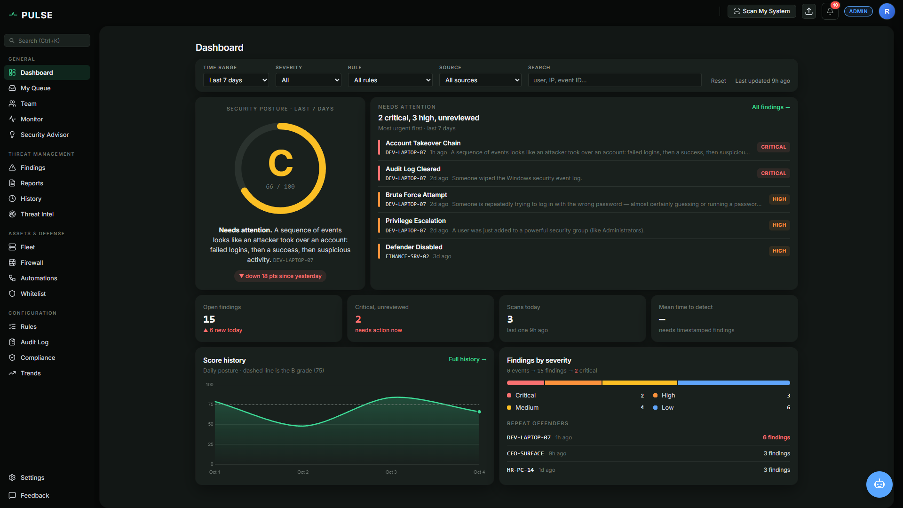
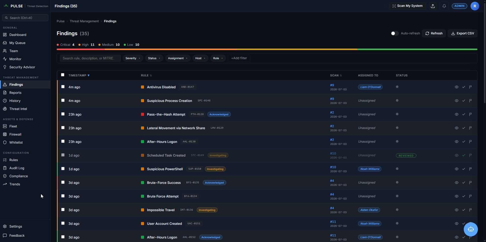
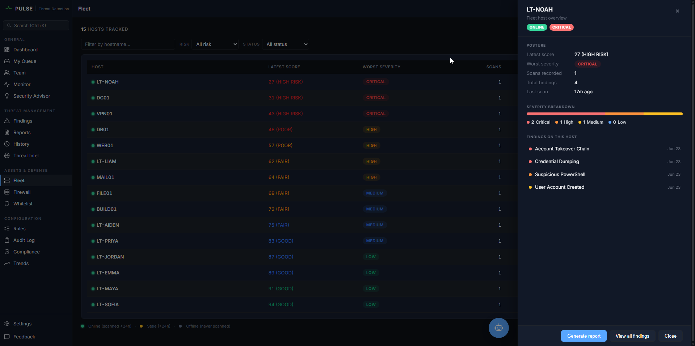
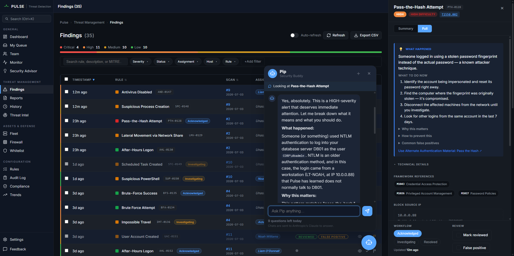

# Pulse

> Open-source Windows threat detection and security reporting for teams without a SOC.


<p align="center">
  
</p>

---

## What Pulse does

Pulse parses Windows `.evtx` event logs (Security log + Sysmon), runs 35 detection rules mapped to MITRE ATT&CK, scores your security posture A through F, and gives you a web dashboard for triage. Every finding explains itself in plain language — what happened, why it matters, and what to do right now.

It doesn't stop at detection. One **Investigate** click looks up every IP, domain and file hash in a finding across AbuseIPDB, VirusTotal, GreyNoise, AlienVault OTX, GeoIP, Whois and DNS, so analysts never leave Pulse. **Playbooks** react to new findings on their own: they run those lookups immediately and propose responses (block an IP, alert the team), which always wait for a person to approve. Generate professional reports in one click (PDF, HTML, JSON, CSV) from a catalog of 9 templates covering threat detection, executive summaries, compliance mapping, and incident investigation.

---

## Quick start

```bash
git clone https://github.com/barrytd/Pulse.git
cd Pulse
pip install -r requirements-lock.txt   # exact pins — a fresh clone can't pull a breaking major
python main.py --api
```

> Dev setup? Use `pip install -r requirements.txt` (loose `>=` ranges) instead. `requirements-lock.txt` is the exact-pinned set and is the safe default for a first run.

Now open **`http://localhost:8000`**. The first visit lands on the Pulse landing page — click **Get started** and **create an account** (the first account becomes the admin). You're taken straight to the dashboard, where you can upload any file from `samples/` to see Pulse light up:

- `samples/brute-force-server.evtx` — domain controller brute-force + account takeover (6 rules, grade D)
- `samples/credential-theft-workstation.evtx` — Mimikatz + LSASS dump + lateral movement (4 rules, grade D)
- `samples/persistence-malware.evtx` — service install + scheduled task + Run-key write (6 rules, grade D)
- `samples/lateral-movement-dc.evtx` — Kerberoasting + Golden Ticket + DCSync (5 rules, grade D)
- `samples/sysmon-execution-chain.evtx` — phishing macro → PowerShell → LSASS access → C2 beacon (4 rules, grade D)

On Windows, every scan also audits the live Windows Firewall policy of the machine running Pulse, so an upload can add a few firewall findings on top of the sample's own. See [`samples/README.md`](samples/README.md) for what each scenario simulates and which rules it triggers.

### Quick start with Docker

```bash
git clone https://github.com/barrytd/Pulse.git
cd Pulse
docker compose up -d
```

Open **`http://localhost:8443`** — note the **different port**: the Python quick start above serves on **8000**, while the Docker stack maps Pulse to **8443**. Postgres + Pulse start as separate containers; the first launch creates the admin user from `PULSE_ADMIN_EMAIL` / `PULSE_ADMIN_PASSWORD` (set those in `docker-compose.yml` first).

---

## Features

| Area | Capability |
|---|---|
| **Detection** | 35 rules mapped to MITRE ATT&CK · 4 time-based correlation rules · 4 Sysmon-based rules (command-line analysis, LSASS access, C2 network, DNS tunneling) · NIST CSF + ISO 27001 control IDs · SIGMA rule import · custom whitelist |
| **Security score** | 0–100, graded A–F. Each unique finding removes a *share of the remaining* score (Critical keeps 72%, High 85%, Medium 93%, Low 97%), so the number keeps meaning something on a bad day: 8 criticals and 40 criticals score differently. Open findings count fully, resolved ones 20%, false positives not at all; a finding fades after a week open, measured from when Pulse recorded it. The dashboard, CLI and every report use the same scorer and the same A–F bands. |
| **Threat intel & Investigate** | Drop-in connector layer ([`pulse/connectors/`](pulse/connectors/)). The finding drawer shows AbuseIPDB and VirusTotal verdicts next to the Block button, and an **Investigate** button runs every lookup that fits the finding's indicators at once: IPs → AbuseIPDB, VirusTotal, GreyNoise, AlienVault OTX, GeoIP; domains → Whois (RDAP), DNS, VirusTotal, OTX; file hashes → VirusTotal, OTX. One provider failing never hides the others. Bring-your-own API keys; GeoIP works out of the box from a bundled offline database (country level, [IP Geolocation by DB-IP](https://db-ip.com)); private IPs and internal hostnames are never sent out. Every lookup is cached and held to the provider's free-tier limits. |
| **Automations (playbooks)** | Stored JSON playbooks react to every new finding: a trigger, conditions (severity, rule, public source IP, …) and ordered steps with placeholders like `{{ finding.source_ip }}`. Lookups run on their own; **response steps (block an IP, post to Slack/Discord) always wait for a manager or admin to approve them**, with the security PIN when one is set, and run exactly the values shown. There's no fully automatic mode. **Automations** page with approvals, playbooks, runs and a step-by-step log; a **click-together playbook builder** (pick conditions from a safe list, add steps, fill inputs with a picker for values like the source IP or an earlier step's result; no JSON needed), three built-in examples, JSON paste import; per-organization connector switches; everything audit-logged. |
| **Security Advisor** | Every finding ships a plain-language Security Guide — what happened, why it matters, immediate actions, exploit difficulty, false-positive tips. Security Advisor sidebar page with posture summary, top concerns, attack-concept explainers, hardening checklist. |
| **Security Buddy ("Pip")** | Optional floating AI chat (bottom-right). Ask what a finding means, whether something looks dangerous, or any security question — answered in plain language by Claude Haiku, proxied server-side (`POST /api/buddy/ask`, key never in the browser). Read-only, prompt-injection-safe, 10 free questions/user/day. Suggests context-aware follow-ups, remembers the chat across refreshes, slides beside the finding drawer to discuss the open finding, and points out-of-scope questions to GitHub/Feedback. Off until an `ANTHROPIC_API_KEY` is set. |
| **Reports** | 9 templates (Threat Detection Summary, Executive Summary, NIST CSF, ISO 27001, Incident Investigation, Fleet Health, Board-Ready Posture, MITRE Coverage, Compliance Gap) · 4 formats each (PDF/HTML/JSON/CSV) · DB-backed persistence with 90-day retention |
| **Dashboard** | Single-page app. The home page leads with one hero (the grade plus a plain-language verdict, next to the unreviewed critical/high findings), then a 4-stat strip (open findings, critical unreviewed, scans today, mean time to detect), then score history and findings by severity. A new account sees a "Run your first scan" call to action instead of empty zeros · live monitor (SSE) · finding drawer with notes, workflow states, assignment · Ctrl+K palette · light and dark themes |
| **Alerting** | SMTP email · Slack + Discord webhooks · per-rule cooldown · live monitor email alerts |
| **Fleet** | Per-host security score · risk tier · stale-host spotlight · severity mix · drill-into-host view · CSV export |
| **Firewall** | `pfirewall.log` parser · port-scan detection · Pulse-managed IP block list via `netsh advfirewall` · one-click block from finding drawer · approved playbook blocks push only their own IP |
| **Compliance** | NIST CSF + ISO 27001 control coverage · coverage-gap report (uncovered techniques, silent rules, noisy rules) |
| **Team & roles** | Three-role hierarchy: admin · manager · analyst. **My Queue** page (analyst's assigned, unresolved findings sorted by priority → severity → age, with in-queue / overdue / due-today / resolved-today tiles) · **assignment dialog** (pick analyst + P1–P4 priority + due date + note, from the finding drawer or the Findings bulk bar) · dedicated **Team** page (per-analyst open count, severity mix, oldest-unresolved age, avg fix time, click-through to their findings; manager/admin only). |
| **API** | FastAPI surface with Swagger at `/docs` · Bearer-token auth · REST endpoints for scan upload, history, reports, agent transport |
| **Agent** | Packaged `pulse-agent.exe` · two-token enrollment · 60s heartbeat + 30min scan cadence · auto-update probe · ACL self-audit |
| **Self-hosted & air-gap friendly** | No third-party CDNs, web fonts, or telemetry — Chart.js and Lucide are **version-pinned and vendored** (`static/vendor/`), fonts use a system stack, so the dashboard renders **fully offline / air-gapped** and leaks nothing to external hosts. The only outbound calls are the ones you opt into: threat-intel lookups once you add a key, Whois/DNS lookups when you click Investigate, alert webhooks/email, and Pip. |
| **Auth & hardening** | Mandatory **6-digit email OTP** on signup (verification screen with resend + attempt limits; auto-verifies on no-SMTP self-host so a fresh install isn't bricked) · **authenticator-app 2FA** (TOTP, RFC 6238 — QR enrollment, single-use recovery codes, ±1 drift window, replay-protected, optional org-wide "require 2FA" policy, admin org-scoped reset) · **CSRF** protection on mutating routes · per-IP login/OTP/2FA rate-limits + lockouts · optional step-up **security PIN** · multi-tenant org isolation |
| **Multi-tenant** | Every row scoped to `organization_id` · self-signup mints fresh org · email verification · admin invites |

---

## Detection rules

35 rules — event-based, time-based correlation, and Sysmon-based — sorted by severity. Detection logic: [`pulse/core/detections.py`](pulse/core/detections.py); rule metadata (severity, MITRE, NIST/ISO): [`pulse/core/rules_config.py`](pulse/core/rules_config.py). (DCSync Attempt and Suspicious Child Process aren't in `rules_config.py` yet, so they can't be switched off on the Rules page. Tracked under Bugs in [`ROADMAP.md`](ROADMAP.md).)

| Rule | Event ID(s) | Severity | MITRE |
|---|---|---|---|
| Account Takeover Chain | (correlated) | 🔴 CRITICAL | T1078 |
| Brute-Force Success | (correlated) | 🔴 CRITICAL | T1078 |
| Credential Dumping | 4656 · 4663 | 🔴 CRITICAL | T1003.001 |
| DCSync Attempt | 4662 | 🔴 CRITICAL | T1003.006 |
| Golden Ticket | 4768 | 🔴 CRITICAL | T1558.001 |
| Lateral Spray | (correlated) | 🔴 CRITICAL | T1021 |
| LSASS Memory Access | Sysmon 10 | 🔴 CRITICAL | T1003.001 |
| Malware Persistence Chain | (correlated) | 🔴 CRITICAL | T1543.003 |
| Privilege Escalation Chain | (correlated) | 🔴 CRITICAL | T1098 |
| Account Lockout | 4740 | 🟠 HIGH | T1110 |
| Antivirus Disabled | 5001 | 🟠 HIGH | T1562.001 |
| Audit Log Cleared | 1102 | 🟠 HIGH | T1070.001 |
| Brute Force Attempt | 4625 | 🟠 HIGH | T1110 |
| Firewall Disabled | 4950 | 🟠 HIGH | T1562.004 |
| Firewall Profile Disabled | (config) | 🟠 HIGH | T1562.004 |
| Impossible Travel | (correlated) | 🟠 HIGH | T1078 |
| Kerberoasting | 4769 | 🟠 HIGH | T1558.003 |
| Lateral Movement via Network Share | 5140 · 5145 | 🟠 HIGH | T1021.002 |
| Pass-the-Hash Attempt | 4624 | 🟠 HIGH | T1550.002 |
| Privilege Escalation | 4732 | 🟠 HIGH | T1548 |
| Suspicious Child Process | 4688 | 🟠 HIGH | T1059 |
| Suspicious DNS Query | Sysmon 22 | 🟠 HIGH | T1071.004 |
| Suspicious Network Connection | Sysmon 3 | 🟠 HIGH | T1071 |
| Suspicious PowerShell | 4104 | 🟠 HIGH | T1059.001 |
| Suspicious Process Creation | Sysmon 1 | 🟠 HIGH | T1059 |
| Suspicious Registry Modification | 4657 | 🟠 HIGH | T1547.001 |
| After-Hours Logon | 4624 | 🟡 MEDIUM | T1078 |
| Firewall Any-Any Allow Rule | (config) | 🟡 MEDIUM | T1562.004 |
| Firewall Overly Broad Scope | (config) | 🟡 MEDIUM | T1562.004 |
| Firewall Rule Changed | 4946 · 4947 | 🟡 MEDIUM | T1562.004 |
| Logon from Disabled Account | 4625 | 🟡 MEDIUM | T1078 |
| RDP Logon Detected | 4624 | 🟡 MEDIUM | T1021.001 |
| Scheduled Task Created | 4698 | 🟡 MEDIUM | T1053.005 |
| Service Installed | 7045 | 🟡 MEDIUM | T1543.003 |
| User Account Created | 4720 | 🟡 MEDIUM | T1136.001 |

---

## Architecture

**Server** — Python 3.10+ · [FastAPI](https://fastapi.tiangolo.com/) · SQLite by default, PostgreSQL with `DATABASE_URL=postgresql://…` via a pluggable adapter ([`pulse/db_backend.py`](pulse/db_backend.py)). No build step on the frontend: vanilla ES modules under [`pulse/static/js/`](pulse/static/js/), CSS variables for theming, Server-Sent Events for the live monitor feed.

**Agent** — Same Python package, packaged via PyInstaller into a 37 MB Windows binary (`pulse-agent.exe`). Runs the same detection engine locally and POSTs findings to the server over HTTPS. Two-token auth: a single-use `pe_…` enrollment token mints a long-lived `pa_…` bearer; both stored sha256-at-rest. See [`pulse/agent/`](pulse/agent/) and [`scripts/build_agent.py`](scripts/build_agent.py).

**Integrations** — [`pulse/connectors/`](pulse/connectors/) holds one file per outside service (or local lookup), each a small class with the same interface that registers itself: enrichment connectors (AbuseIPDB, VirusTotal, GreyNoise, AlienVault OTX, GeoIP, Whois, DNS) and response connectors (firewall block, Slack/Discord post). The playbook engine ([`pulse/soar/`](pulse/soar/)) runs on a background worker: it matches each newly saved finding against the organization's playbooks and records every step of every run. Playbook conditions and placeholders use a small whitelisted expression language, never `eval`.

**Storage** — All scan history, findings, audit log, agents, notifications, organizations, users, API tokens, IP block list, finding notes, playbooks, playbook runs and per-org connector switches live in one schema ([`pulse/database.py`](pulse/database.py)). Multi-tenant rows carry an `organization_id`; the API helper `_read_scope_kwargs` enforces tenant isolation on every read/write.

**Tests** — 1781 passing across the suite; one test runs `pip-audit --strict` online and is marked `@pytest.mark.network` (skip offline with `-m "not network"`).

---

## Screenshots

<table>
  <tr>
    <td width="50%" valign="top">
      <br>
      <sub><b>Findings</b> — the triage queue: findings across every severity, with owners and workflow state at a glance.</sub>
    </td>
    <td width="50%" valign="top">
      <br>
      <sub><b>Fleet</b> — every host risk-scored worst-first, with a per-host drilldown drawer.</sub>
    </td>
  </tr>
  <tr>
    <td colspan="2" valign="top">
      <br>
      <sub><b>Every finding explains itself</b> — and <b>Pip</b>, the built-in AI security buddy, answers "is this bad?" in plain English right beside the alert.</sub>
    </td>
  </tr>
</table>

---

## Documentation

- [`ROADMAP.md`](ROADMAP.md) — status board (in progress / up next / blocked / backlog / shipped)
- [`CHANGELOG.md`](CHANGELOG.md) — commit-level history
- [`CONTRIBUTING.md`](CONTRIBUTING.md) — dev setup, running tests, adding a detection rule, adding a connector, PR process
- [`docs/2026-09-26-soar-playbooks-and-integrations.md`](docs/2026-09-26-soar-playbooks-and-integrations.md) — design of the connector layer and playbook engine
- [`pulse/README.md`](pulse/README.md) — per-module index of the application package
- API docs — `http://localhost:8000/docs` (Swagger UI) when running with `--api`
  - **CSRF note for API clients:** cookie-authenticated mutating calls (POST/PUT/PATCH/DELETE) from `curl`/Postman must send the header **`X-Pulse-Request: 1`**, or they're rejected with 403. Requests authenticated with a **Bearer API token are exempt** (the browser never auto-attaches one, so they can't be forged cross-site) — use a token for scripting.

---

## Production deploys

```bash
pip install -r requirements-lock.txt          # exact pins, not >= ranges
python -m pip_audit --strict                  # CVE scan against the pinned set
```

`requirements.txt` (loose ranges) is for dev; `requirements-lock.txt` (exact pins) is for production / hosted deploys so a compromised or buggy upstream package can't silently break Pulse or introduce a vulnerable transitive dep. A test in [`tests/test_security_hardening.py`](tests/test_security_hardening.py) runs `pip-audit --strict` against the live environment on every test sweep (marked `@pytest.mark.network`, skip with `-m "not network"`).

### Hosted multi-tenant mode

Set `PULSE_HOSTED_SIGNUP=1` to let each signup create its own isolated organization (tenant). In this mode an org's admin is scoped to their **own** organization — they can't see or manage another tenant's data or users. To grant yourself cross-tenant (platform-owner) access, set `PULSE_SUPERADMIN_EMAILS` to a comma-separated allowlist of emails; this is **env-only** and can't be granted through signup or the API, so no tenant can escalate into it. Single-tenant self-host (the default, no `PULSE_HOSTED_SIGNUP`) is unaffected — the lone admin sees everything, including CLI-uploaded scans.

**Behind a reverse proxy / load balancer (Render, nginx, Cloudflare):** set `PULSE_TRUSTED_PROXY_HOPS` to the number of trusted proxies in front of Pulse — **`1`** for a single load balancer like Render. The rate limiter then reads the real client IP from `X-Forwarded-For` past that many trusted hops (where a client can't forge it). The default is **`0`**, which ignores `X-Forwarded-For` entirely and uses the direct socket peer — correct for local and directly-exposed installs. If you run behind a proxy and *don't* set this, every client collapses to the proxy's IP and shares one rate-limit bucket.

> **Public signup:** the security gates for opening hosted signup have all shipped: CSRF protection on mutating routes, trusted-proxy `X-Forwarded-For` handling (set `PULSE_TRUSTED_PROXY_HOPS` above), org-scoped admin lists, and the mandatory email OTP.

### Threat-intel keys and the GeoIP database

Every outside lookup is bring-your-own and off until you set it up under **Settings › Notifications** (or with environment variables on a hosted deploy): `ABUSEIPDB_API_KEY`, `VIRUSTOTAL_API_KEY`, `GREYNOISE_API_KEY`, `OTX_API_KEY`. Keys stay on the server; the browser only ever sees whether one is set. VirusTotal's free public key is for non-commercial use only.

GeoIP needs no setup: Pulse bundles DB-IP's free **IP to Country Lite** database ([`pulse/data/`](pulse/data/README.md), CC BY 4.0, [IP Geolocation by DB-IP](https://db-ip.com)), so country-level lookups work offline on every install. For city-level detail, download DB-IP "IP to City Lite" or MaxMind GeoLite2 City (free account) and set its path in Settings, set `PULSE_GEOIP_DB`, or drop it in the top-level `data/` folder; your file takes priority. (City Lite is too large to bundle, and MaxMind's license forbids redistribution.) Whois and DNS need no key.

### Enabling Pip (the AI Security Buddy)

Pip is **off by default**. To turn it on, set an Anthropic API key in the server's environment before starting Pulse:

```bash
export ANTHROPIC_API_KEY="sk-ant-..."   # Windows PowerShell: $env:ANTHROPIC_API_KEY="sk-ant-..."
```

The floating chat appears once a key is present. The key is read **server-side only** ([`pulse/buddy.py`](pulse/buddy.py)) and never reaches the browser; questions are answered by **Claude Haiku 4.5** through a backend proxy (`POST /api/buddy/ask`). API usage is pay-as-you-go (separate from any personal Claude subscription) — each user is capped at **10 questions/day** to keep cost predictable. Finding/event text sent to the model is fenced as untrusted data (prompt-injection defense), Pip is read-only, and the panel discloses that chats are sent to Anthropic.

---

## Contributing

Pull requests welcome. See [`CONTRIBUTING.md`](CONTRIBUTING.md) for dev environment setup, the step-by-step tutorials for adding a detection rule or a connector, and the PR process. Good first issues are labeled on GitHub.

For security issues, please use GitHub's private vulnerability reporting — don't open a public issue.

---

## License

MIT — see [`LICENSE`](LICENSE).
